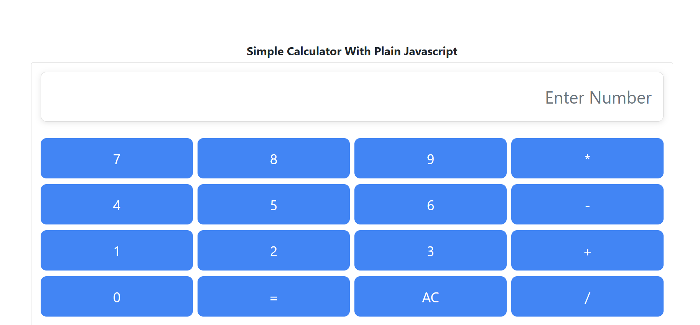

# Simple Calculator with Plain JavaScript

A simple, interactive calculator built using plain JavaScript, HTML, and CSS. This project implements basic arithmetic operations such as addition, subtraction, multiplication, and division. The calculator has a clean and user-friendly interface.

## Features

* **Basic Operations:** Addition, subtraction, multiplication, and division.
* **Responsive Design:** Works on both desktop and mobile devices.
* **User-Friendly Interface:** Simple layout with large buttons for easy interaction.
* **No External Libraries:** Built entirely with vanilla JavaScript, HTML, and CSS.

## Technologies Used

* **HTML**: Structure of the calculator and the layout.
* **CSS**: Styling the calculator buttons and layout.
* **JavaScript**: Handling the logic for the arithmetic operations.

## How to Use

1. Clone or download this repository.
2. Open the `index.html` file in any modern browser.
3. Use the buttons to perform basic arithmetic operations.

## Screenshots



## Getting Started

To run this project locally:

1. Clone the repository:

   ```bash
   git clone https://github.com/deepak-vdk/Simple-Calculator-With-Plain-Javascript.git
   ```

2. Navigate to the project directory:

   ```bash
   cd Simple-Calculator-With-Plain-Javascript
   ```

3. Open `index.html` in your browser.

## Future Enhancements

* Implement more advanced math functions (e.g., square roots, percentages, etc.).
* Improve error handling for edge cases (like dividing by zero).
* Add a history feature to track previous calculations.

## License

This project is open-source and available under the [MIT License](LICENSE).

---

